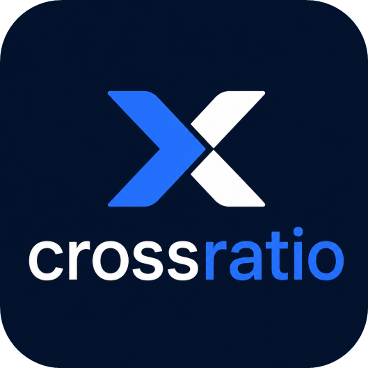

# Crossratio

Un service web qui vérifie automatiquement ton **ratio** sur plusieurs sites de torrent (1337x, C411, Torr9, etc.)
et t'envoie une **notification hebdomadaire** via [ntfy](https://ntfy.sh/).

---

## ✨ Fonctionnalités

- ✅ **Scraping ou API** : Récupère le ratio depuis des sites en HTML ou des APIs JSON.
- ✅ **Notifications ntfy** : Reçois une alerte avec tous tes ratios en une seule notification.
- ✅ **Dockerisé** : Facile à déployer sur un serveur ou un Raspberry Pi.
- ✅ **Personnalisable** : Ajoute/supprime des sites via le fichier `.env`.
- ✅ **Markdown** : Les notifications supportent le formatage (gras, sauts de ligne, etc.).

---

## 📦 Prérequis

- [Docker](https://www.docker.com/) et [Docker Compose](https://docs.docker.com/compose/)
- Un compte sur [ntfy.sh](https://ntfy.sh/) (ou un serveur ntfy auto-hébergé)
- Les **cookies de session** ou **tokens API** pour chaque site de torrent

---

## 🚀 Installation

### 1. Clone le dépôt
```bash
git clone https://github.com/ton-utilisateur/torrent-ratio-notifier.git
cd torrent-ratio-notifier
```

### 2. Configure les variables d'environnement
Crée un fichier `.env` à la racine du projet avec la configuration suivante :

```env
# Configuration ntfy
NTFY_TOPIC=mon_topic_torrent
NTFY_TOKEN=ton_token_ntfy

# Configuration des sites (JSON sur une seule ligne)
SITES_CONFIG='{"C411": {"url": "https://c411.org", "api": false, "selector": "p.text-xl.font-bold.text-blue-600", "auth": {"headers": {"Cookie": "session=ton_cookie_session; laravel_session=ton_cookie_laravel"}}}, "Torr9": {"url": "https://api.torr9.net/api/v1/users/me", "api": true, "auth": {"headers": {"Authorization": "Bearer ton_token_api"}}, "uploaded_key": "total_uploaded_bytes", "downloaded_key": "total_downloaded_bytes"}}'
```

> **⚠️ Notes :**
> - Remplace `mon_topic_torrent` et `ton_token_ntfy` par tes identifiants ntfy.
> - Pour chaque site, ajoute les **cookies** ou **tokens API** nécessaires.
> - Pour les sites en **HTML** (`"api": false`), utilise un **sélecteur CSS** valide.
> - Pour les sites en **API** (`"api": true`), spécifie les clés `uploaded_key` et `downloaded_key`.

---

## 🛠️ Configuration

### Ajouter un nouveau site

1. **Trouve le sélecteur CSS** ou les clés API pour le ratio.
2. **Ajoute-le dans `SITES_CONFIG`** (fichier `.env`) :

```json
{
    "NouveauSite": {
        "url": "URL_DU_SITE",
        "api": false,
        "selector": "sélecteur_css",
        "auth": {
            "headers": {
                "Cookie": "ton_cookie"
            }
        }
    }
}
```

---

### Trouver le sélecteur CSS

1. Ouvre le site dans Chrome et connecte-toi.
2. Fais un **clic droit** sur le ratio → **Inspecter**.
3. Repère l'élément HTML contenant le ratio (ex: `<span class="ratio">2.45</span>`).
4. Construis le sélecteur CSS :
   - Exemple : `span.ratio`
   - Pour un texte spécifique : Utilise des classes uniques comme `p.text-xl.font-bold.text-blue-600`.

---

## 🏃 Lancement

### Avec Docker Compose
```bash
# Construis et lance le conteneur
docker-compose up -d --build

# Affiche les logs
docker-compose logs -f

# Arrête le conteneur
docker-compose down
```

### Tester manuellement
```bash
docker-compose exec torrent-ratio-notifier python /app/check_ratio.py
```

---

## 📅 Planification

Le script s'exécute **toutes les semaines le lundi à 12h00** (fuseau horaire : Europe/Paris).
Pour modifier la fréquence :

1. Édite le fichier `cronjob` :
   ```bash
   # Exemple : Tous les jours à 18h
   0 18 * * * root /usr/local/bin/python /app/check_ratio.py >> /var/log/cron.log 2>&1
   ```
2. Reconstruis le conteneur :
   ```bash
   docker-compose up -d --build
   ```

---

## 🔧 Dépannage

### Problèmes courants

| Problème | Solution |
|----------|----------|
| **`Python-dotenv could not parse statement`** | Vérifie la syntaxe JSON dans `.env` (utilise [jsonlint.com](https://jsonlint.com/)). |
| **`string indices must be integers`** | Le sélecteur CSS est incorrect. Vérifie la section [Trouver le sélecteur CSS](#trouver-le-sélecteur-css). |
| **`401 Unauthorized`** | Tes cookies/tokens sont invalides. Régénère-les. |
| **Ratio non trouvé** | Le sélecteur ne cible pas le bon élément. Utilise le script de debug ci-dessous. |

---

### Script de debug

Pour tester un sélecteur CSS :

```python
import requests
from bs4 import BeautifulSoup

URL = "URL_DU_SITE"
SELECTOR = "ton_sélecteur_css"
COOKIES = {"session": "ton_cookie"}

headers = {"User-Agent": "Mozilla/5.0"}
response = requests.get(URL, headers=headers, cookies=COOKIES)
soup = BeautifulSoup(response.text, "html.parser")
ratio_element = soup.select_one(SELECTOR)

if ratio_element:
    print(f"✅ Ratio trouvé : {ratio_element.get_text(strip=True)}")
else:
    print("❌ Sélecteur invalide.")
```

---
## 📜 Exemples de configuration

### Site avec API JSON
```json
{
    "Torr9": {
        "url": "https://api.torr9.net/api/v1/users/me",
        "api": true,
        "auth": {
            "headers": {
                "Authorization": "Bearer xxxx.xxxx.xxxx-xxxx",
                "User-Agent": "Mozilla\/5.0 (Windows NT 10.0; Win64; x64) AppleWebKit\/537.36 (KHTML, like Gecko) Chrome\/148.0.0.0 Safari\/537.36"
            }
        },
        "uploaded_key": "total_uploaded_bytes",
        "downloaded_key": "total_downloaded_bytes"
    }
}
```

### Site en HTML (scraping)
```json
{
    "The Old School": {
        "url": "https://theoldschool.cc/users/victortuga55",
        "selector": "div.key-value__group:has(dt:-soup-contains(\"Ratio\")) dd",
        "auth": {
          "cookies":
          {
            "xxxx": "xxxx=",
            "the_old_school_session": "xxxx=",
            "XSRF-TOKEN": "xxxx="
          }
        } 
    }
}
```

---
## 📚 Ressources

- [Documentation ntfy](https://docs.ntfy.sh/)
- [BeautifulSoup (scraping)](https://www.crummy.com/software/BeautifulSoup/bs4/doc/)
- [Sélecteurs CSS](https://www.w3schools.com/cssref/css_selectors.php)

---
## 🤝 Contribuer

Les contributions sont les bienvenues !

---
## 📜 Licence

MIT
